> 🌐 **Live:** [https://fastmeals.com.br](https://fastmeals.com.br) | **API:** [https://t2fwiydcrc.execute-api.us-east-1.amazonaws.com](https://t2fwiydcrc.execute-api.us-east-1.amazonaws.com/api/products)

# 🍔 FastMeals — Sistema de Gerenciamento de Pedidos e Entregas

Plataforma fullstack de gerenciamento de delivery com **6 microserviços**, **5 microfrontends**, **dashboard analítico**, **algoritmo de otimização Hungarian**, **AI Insights com AWS Bedrock** e **observabilidade com Datadog**.

---

## 📑 Índice
 
1. [Demo](#-demo)
2. [Arquitetura](#-arquitetura)
3. [Clean Architecture + SOLID](#-clean-architecture--solid)
4. [Como Rodar](#-como-rodar)
5. [Stack Tecnológica](#-stack-tecnológica)
6. [Microserviços](#-microserviços)
7. [Frontend — Microfrontends](#-frontend--microfrontends)
8. [Algoritmo de Otimização](#-algoritmo-de-otimização)
9. [Infraestrutura AWS](#️-infraestrutura-aws)
10. [Banco de Dados](#️-banco-de-dados)
11. [Bastion Host — Acesso ao RDS](#-bastion-host--acesso-ao-rds)
12. [Ansible — Automação Operacional](#-ansible--automação-operacional)
13. [FinOps — Gestão de Custos](#-finops--gestão-de-custos)
14. [Observabilidade — Datadog](#-observabilidade--datadog)
15. [Monitoring & Alerting — Datadog](#-monitoring--alerting--datadog)
16. [Qualidade de Código — SonarCloud](#-qualidade-de-código--sonarcloud)
17. [Segurança](#-segurança)
18. [Load Testing — k6](#-load-testing--k6)
19. [CI/CD Pipeline](#-cicd-pipeline)
20. [Testes](#-testes)
21. [Estrutura do Projeto](#-estrutura-do-projeto)
22. [Documentação](#-documentação)
23. [Variáveis de Ambiente](#-variáveis-de-ambiente)
24. [Docker](#-docker)
25. [Autor](#-autor)

---

<!-- GIF de apresentação da aplicação -->


---

## 🏗 Arquitetura

A plataforma segue uma arquitetura de **microserviços** no backend e **microfrontends** no frontend, ambos com **Clean Architecture** e princípios **SOLID**. O backend é orquestrado por Docker Compose com Nginx como API Gateway local, e em produção roda como Lambda Functions via API Gateway HTTP. O frontend utiliza Module Federation para compor 5 SPAs independentes.

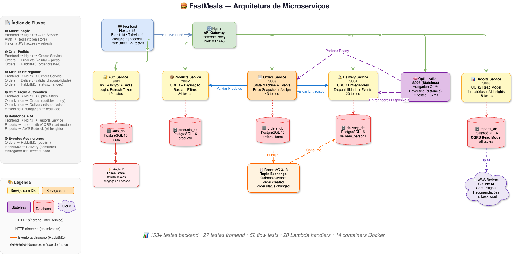

**Padrões implementados:**

- **Database per Service** — cada serviço com seu PostgreSQL isolado
- **CQRS** — reports-service com read model dedicado
- **Event-Driven** — RabbitMQ (topic exchange) para comunicação assíncrona
- **API Gateway** — Nginx (local) / AWS API Gateway HTTP (produção)
- **Clean Architecture** — Domain → Application → Infrastructure → Lambda
- **Lambda per Use Case** — cada operação é uma função independente (23 Lambda handlers)
- **Microfrontends** — Module Federation com shell host + 4 remotes independentes

&nbsp;

---

## 🧅 Clean Architecture + SOLID

Cada microserviço segue 4 camadas com a Dependency Rule: dependências apontam sempre para dentro — Domain nunca conhece Infrastructure.

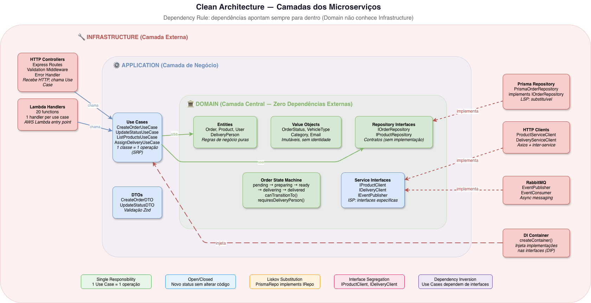

**Camadas por microserviço:**

```
src/
├── domain/          → Entities, Value Objects, Repository Interfaces
├── application/     → Use Cases, DTOs, Service Interfaces
├── infrastructure/  → Prisma, HTTP Clients, Express Controllers, Config
└── lambda/          → AWS Lambda Handlers (1 per use case)
```

&nbsp;

---

## 🚀 Como Rodar

### Pré-requisitos

- [Docker Desktop](https://www.docker.com/products/docker-desktop/) (>= 4.0)
- [Node.js](https://nodejs.org/) (>= 20) — apenas para desenvolvimento local
- [Git](https://git-scm.com/)

&nbsp;

### Com Docker (recomendado) — 3 comandos

```bash
# 1. Clonar o repositório
git clone https://github.com/vynnydev/fastmeals.git
cd fastmeals

# 2. Subir todos os serviços (19 containers: 7 infra + 6 backend + 5 frontend + 1 gateway)
docker compose up --build -d

# 3. Preparar bancos de dados (migrations + seed)
./scripts/prepare-services-linux-mac.sh
```

Acesse:

| Aplicação | URL |
|-----------|-----|
| **Frontend (Shell)** | http://localhost:5000 |
| **API Gateway (Nginx)** | http://localhost |
| **RabbitMQ Management** | http://localhost:15672 (guest/guest) |

> Os 4 remotes (orders :5001, products :5002, delivery :5003, reports :5004) são carregados automaticamente pelo shell via Module Federation.

&nbsp;

### Credenciais de acesso

| Email | Senha | Perfil | Permissões |
|-------|-------|--------|------------|
| admin@fastmeals.com | Admin@123 | Administrador | Acesso total: CRUD de produtos, pedidos, entregadores, otimização |
| viewer@fastmeals.com | Viewer@123 | Visualizador | Somente leitura: visualizar pedidos, produtos e relatórios |

&nbsp;

### Desenvolvimento local (Microfrontends)

```bash
# Terminal 1 — Infraestrutura
docker compose up auth-db products-db orders-db delivery-db reports-db redis rabbitmq -d

# Terminal 2..7 — Backend (cada serviço)
cd backend/services/auth-service && npm install && npm run seed && npm run dev
cd backend/services/products-service && npm install && npm run seed && npm run dev
cd backend/services/orders-service && npm install && npm run seed && npm run dev
cd backend/services/delivery-service && npm install && npm run seed && npm run dev
cd backend/services/optimization-service && npm install && npm run dev
cd backend/services/reports-service && npm install && npm run seed && npm run dev

# Terminal 8..14 — Frontend (shell + 4 remotes, cada remote precisa de build + preview)
cd frontend/microfrontends/shell && npm install && npm run dev

cd frontend/microfrontends/remote-orders && npm install && npm run dev:fed    # Terminal 9
cd frontend/microfrontends/remote-orders && npm run preview                   # Terminal 10

cd frontend/microfrontends/remote-products && npm install && npm run dev:fed  # Terminal 11
cd frontend/microfrontends/remote-products && npm run preview                 # Terminal 12

cd frontend/microfrontends/remote-delivery && npm install && npm run dev:fed  # Terminal 13
cd frontend/microfrontends/remote-delivery && npm run preview                 # Terminal 14

cd frontend/microfrontends/remote-reports && npm install && npm run dev:fed   # Terminal 15
cd frontend/microfrontends/remote-reports && npm run preview                  # Terminal 16
```

&nbsp;

### Rodar testes

```bash
# Backend (em cada serviço)
cd backend/services/auth-service && npm test          # 100 testes
cd backend/services/products-service && npm test      # 98 testes
cd backend/services/orders-service && npm test        # 158 testes
cd backend/services/delivery-service && npm test      # 107 testes
cd backend/services/optimization-service && npm test  # 72 testes
cd backend/services/reports-service && npm test       # 73 testes

# Teste de fluxo completo (requer Docker rodando)
./scripts/test-flow.sh                                # 52 assertions
```

&nbsp;

---

## 🛠 Stack Tecnológica

### Backend

| Tecnologia | Versão | Uso |
|-----------|--------|-----|
| Node.js | 20 LTS | Runtime |
| TypeScript | 5.7 | Tipagem estrita (`strict: true`, zero `any`) |
| Express | 4.21 | HTTP server |
| Prisma | 6.19 | ORM com PostgreSQL |
| PostgreSQL | 16 | Banco relacional (5 instâncias) |
| Redis | 7 | Token store para JWT refresh tokens |
| RabbitMQ | 3.13 | Mensageria assíncrona (topic exchange) |
| Zod | 3.24 | Validação de entrada |
| Pino | 10 | Logs estruturados (JSON) |
| Swagger | 5.0 | Documentação OpenAPI (`/docs`) |
| bcrypt | — | Hash de senhas (10 salt rounds) |
| JWT | — | Access token (15min) + Refresh token (7d) |
| AWS Bedrock | Amazon Nova | AI Insights no reports-service |
| Vitest | 3.0 | Framework de testes |
| Nginx | Alpine | API Gateway / reverse proxy |

&nbsp;

### Frontend

| Tecnologia | Versão | Uso |
|-----------|--------|-----|
| Vite | 6 | Build tool + dev server |
| React | 18 | UI library |
| TypeScript | 5.7 | Tipagem estrita |
| Module Federation | @originjs/vite-plugin-federation | Microfrontends (shell + 4 remotes) |
| Tailwind CSS | 4 | Estilização utility-first |
| shadcn/ui | — | Componentes acessíveis (Radix UI) |
| Zustand | 5 | Gerenciamento de estado |
| React Hook Form | 7 | Formulários com validação (remote-products) |
| Zod | 3.24 | Schema validation |
| Recharts | 3 | Gráficos e visualizações (remote-reports) |
| Axios | 1.13 | HTTP client com interceptors |
| Sonner | 2 | Toast notifications |
| Playwright | latest | Testes E2E (28 testes) |

&nbsp;

### DevOps & Observabilidade
 
| Tecnologia | Uso |
|-----------|-----|
| Terraform | IaC — 11 módulos gerenciando toda a infraestrutura AWS |
| Ansible | Automação operacional — 7 playbooks (migrations, seeds, backups, health checks) |
| Infracost | FinOps — estimativa de custos do Terraform com CI/CD em PRs |
| GitHub Actions | CI/CD — 9 workflows (CI, deploy, quality, security, load testing, IaC, cost estimation) |
| SonarCloud | Qualidade de código, cobertura, Quality Gate |
| Trivy | Security scanning — vulnerabilidades em filesystem, dependências e Docker images |
| k6 | Load testing — smoke, load e stress tests contra produção |
| Datadog | Observabilidade — APM tracing, Flame Graph, Service Map, SQL traces, métricas Lambda |
| Helmet.js | Security headers em todos os microserviços (CSP, HSTS, X-Frame-Options) |
| AWS Amplify | Deploy frontend com CDN global e SSL automático |
| AWS Lambda | 23 funções serverless (Node.js 20) |
| AWS API Gateway | HTTP API com CORS e logging |

&nbsp;

---

## 🔧 Microserviços

| Serviço | Porta | Banco | Testes | Responsabilidade |
|---------|-------|-------|--------|-----------------|
| [auth-service](backend/services/auth-service/README.md) | 3001 | auth_db + Redis | 100 | JWT login, refresh token, bcrypt |
| [products-service](backend/services/products-service/README.md) | 3002 | products_db | 98 | CRUD produtos, paginação, busca |
| [orders-service](backend/services/orders-service/README.md) | 3003 | orders_db | 158 | Pedidos, máquina de estados, inter-service |
| [delivery-service](backend/services/delivery-service/README.md) | 3004 | delivery_db | 107 | CRUD entregadores, disponibilidade |
| [optimization-service](backend/services/optimization-service/README.md) | 3005 | — (stateless) | 72 | Hungarian Algorithm + Haversine |
| [reports-service](backend/services/reports-service/README.md) | 3006 | reports_db (CQRS) | 73 | Analytics, AI Insights (Bedrock) |

&nbsp;

### Comunicação entre serviços

```
orders-service ──HTTP──▶ products-service     (validar produtos + snapshot preço)
orders-service ──HTTP──▶ delivery-service     (validar entregador + disponibilidade)
orders-service ──AMQP──▶ RabbitMQ            (order.created, order.status.changed)
delivery-service ◀──AMQP── RabbitMQ          (atualizar status do entregador)
optimization-service ──HTTP──▶ orders-service (buscar pedidos ready)
optimization-service ──HTTP──▶ delivery-service (buscar entregadores disponíveis)
reports-service ──SQL──▶ reports_db           (CQRS read model cross-domain)
```

&nbsp;

### Máquina de estados dos pedidos

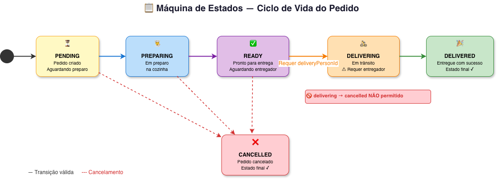

| De | Para | Condição |
|----|------|----------|
| pending | preparing, cancelled | — |
| preparing | ready, cancelled | — |
| ready | delivering | Requer `deliveryPersonId` atribuído |
| ready | cancelled | — |
| delivering | delivered | — |

> `delivering → cancelled` **não é permitido**. `delivered` e `cancelled` são estados finais.

&nbsp;

### Fluxo de criação de pedido

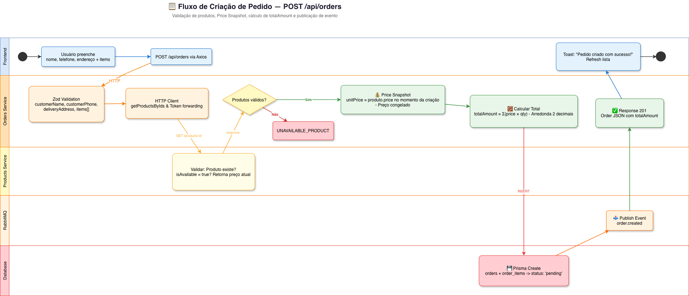

&nbsp;

---

## 🖥 Frontend — Microfrontends

O frontend foi construído com arquitetura de **microfrontends** usando **Vite + Module Federation**, onde cada domínio de negócio é uma SPA independente que é composta em runtime pelo shell host.

<!-- Diagrama da arquitetura de microfrontends -->
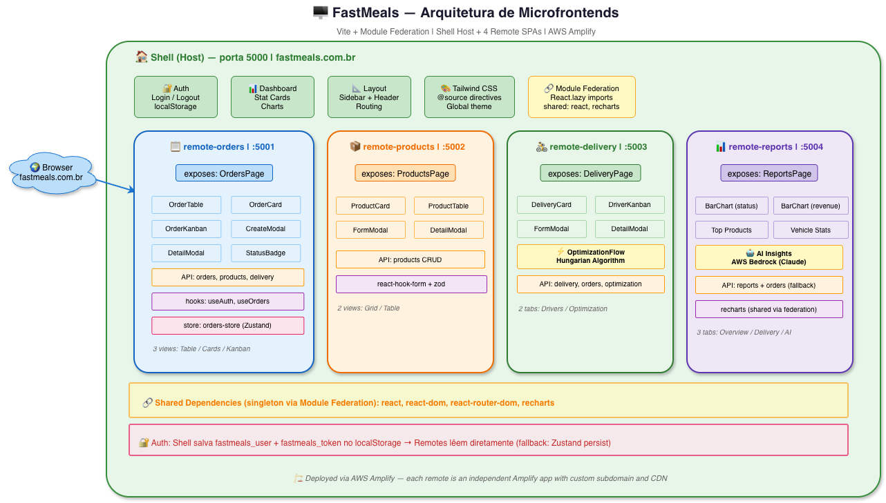

&nbsp;

### Arquitetura

```
┌─────────────────────────────────────────────────────────────┐
│  Shell (Host) — porta 5000                                  │
│  Auth, Dashboard, Layout, Sidebar, Header                   │
│  Tailwind CSS + @source directives (gerencia CSS global)    │
│                                                             │
│  ┌──────────┐ ┌──────────┐ ┌──────────┐ ┌──────────┐      │
│  │ Orders   │ │ Products │ │ Delivery │ │ Reports  │      │
│  │ :5001    │ │ :5002    │ │ :5003    │ │ :5004    │      │
│  │ remoteE. │ │ remoteE. │ │ remoteE. │ │ remoteE. │      │
│  └──────────┘ └──────────┘ └──────────┘ └──────────┘      │
└─────────────────────────────────────────────────────────────┘
```

> Acesse o readme de cada microfrontend clicando no nome dele na tabela a seguir.

| Microfrontend | Porta | Expõe | Responsabilidade |
|--------------|-------|-------|------------------|
| [**Shell**](frontend/microfrontends/shell/readme-shell.md) | 5000 | — (host) | Auth, Dashboard, Layout, roteamento, Tailwind global |
| [**remote-orders**](frontend/microfrontends/remote-orders/readme-remote-orders.md) | 5001 | `OrdersPage` | Pedidos: tabela, cards, kanban, criação, status, atribuição |
| [**remote-products**](frontend/microfrontends/remote-products/readme-remote-products.md) | 5002 | `ProductsPage` | Produtos: grid, tabela, CRUD com react-hook-form + zod |
| [**remote-delivery**](frontend/microfrontends/remote-delivery/readme-remote-delivery.md) | 5003 | `DeliveryPage` | Entregadores: cards, kanban, CRUD, otimização Hungarian |
| [**remote-reports**](frontend/microfrontends/remote-reports/readme-remote-reports.md) | 5004 | `ReportsPage` | Relatórios: charts recharts, analytics, AI Insights Bedrock |

&nbsp;

### Decisões arquiteturais do frontend

| Decisão | Motivo |
|---------|--------|
| **Sem Tailwind nos remotes** | Shell gerencia todo o CSS via `@source` directives, evitando conflitos de CSS reset entre instâncias |
| **React no `shared` do federation** | Evita dual React instance crashes (`useSyncExternalStore` errors) |
| **recharts no `shared`** | Mesma razão — recharts usa hooks internos que precisam da mesma instância React |
| **Auth via localStorage** | Shell salva `fastmeals_user` + `fastmeals_token`; remotes lêem diretamente com fallback para Zustand persist |
| **Sonner ao invés de useToast** | Toast library sem dependência de contexto React — funciona em qualquer remote |
| **AvatarFallback sem AvatarImage** | `AvatarImage` do Radix usa `useSyncExternalStore` que crasha com dual React |

&nbsp;

### Funcionalidades por módulo

**Dashboard (Shell)** — Visão geral com stat cards animados (receita, pedidos, entregas, tempo médio), gráficos de pedidos por status e últimos pedidos.

**Gestão de Pedidos (remote-orders)** — Três visualizações (Tabela / Cards / Kanban), criação de pedido com carrinho de produtos, transição de status com validação, atribuição manual de entregador e cancelamento.

**Gestão de Produtos (remote-products)** — Grid e tabela com filtros por categoria (Refeições / Bebidas / Sobremesas / Acompanhamentos), busca por nome, CRUD completo com modal de detalhes, validação com zod.

**Entregadores e Otimização (remote-delivery)** — Cards e Kanban de entregadores (Disponíveis / Em Entrega / Inativos), CRUD completo, e aba de **Otimização** com algoritmo Hungarian mostrando atribuições sugeridas, distâncias calculadas (Haversine) e comparação greedy vs. ótimo.

**Relatórios e AI Insights (remote-reports)** — Receita diária, pedidos por status, ranking de top produtos, tempo de entrega por veículo (Moto / Bicicleta / Carro), filtro por período, e **Insights com IA** via AWS Bedrock (Amazon Nova) gerando resumo, recomendações e destaques.

&nbsp;

### Destaques de UX

| Feature | Descrição |
|---------|-----------|
| Números animados | Contagem progressiva com easing nos stat cards |
| Skeleton loading | Feedback visual durante carregamento |
| Empty states | Mensagens descritivas quando não há dados |
| Error states | Tratamento de erros com botão retry |
| Dark mode | Tema gold escuro com oklch colors |
| Responsividade | Sidebar colapsável, layout adaptativo mobile |
| Permissões | Viewer não vê botões de escrita (CRUD, otimização) |
| Kanban drivers | Visualização por status com detalhes do pedido atual |
| Máscara de telefone | Formatação automática `(XX) XXXXX-XXXX` |
| Atribuição manual | Select com entregadores ocupados desabilitados |

&nbsp;

---

## 🧠 Algoritmo de Otimização

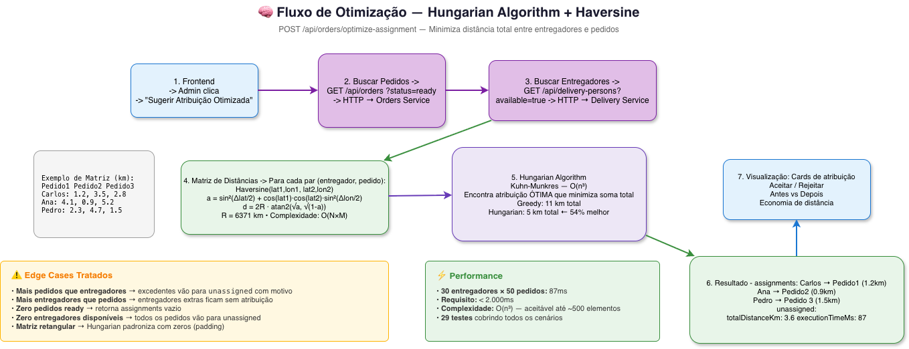

&nbsp;

### Hungarian Algorithm (Kuhn-Munkres) — O(n³)

Resolve o **Problema de Atribuição**: dado N entregadores e M pedidos com status `ready`, encontra a atribuição que **minimiza a distância total percorrida**.

```
          Pedido 1    Pedido 2
Pessoa A:  1 km        2 km
Pessoa B:  3 km       10 km

Greedy:    A→1 (1km) + B→2 (10km) = 11 km
Hungarian: A→2 (2km) + B→1 (3km)  =  5 km  ← 54% melhor
```

&nbsp;

### Haversine — O(1)

Calcula a distância geodésica (curvatura da Terra) entre dois pontos:

```
a = sin²((lat2 - lat1) / 2) + cos(lat1) · cos(lat2) · sin²((lon2 - lon1) / 2)
c = 2 · atan2(√a, √(1-a))
d = R · c   (R = 6371 km)
```

&nbsp;

### Performance

| Cenário | Tempo | Requisito |
|---------|-------|-----------|
| 30 entregadores × 50 pedidos | **87ms** | < 2.000ms |
| 10 × 10 | < 5ms | — |
| 1 × 1 | < 1ms | — |

&nbsp;

### Endpoint

```
POST /api/orders/optimize-assignment
```

Retorna `assignments` (pedido → entregador com distância), `unassigned` (pedidos sem entregador disponível) e `totalDistanceKm`.

&nbsp;

---

## ☁️ Infraestrutura AWS

Toda a infraestrutura é gerenciada por **Terraform** com **11 módulos**, estado remoto no S3 e locking com DynamoDB.

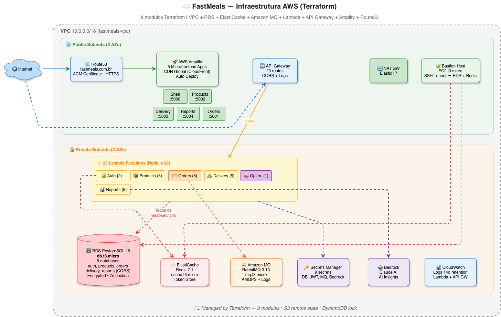

| Recurso | Serviço AWS | Especificação |
|---------|------------|---------------|
| Banco de dados | RDS PostgreSQL 16 | db.t3.micro, 5 databases, encrypted |
| Cache | ElastiCache Redis 7.1 | cache.t3.micro, token store |
| Mensageria | Amazon MQ RabbitMQ 3.13 | mq.t3.micro, AMQPS |
| Backend | 23 Lambda Functions | Node.js 20, 256MB, VPC, Datadog Tracer + Extension (2 layers) |
| API | API Gateway HTTP | 23 routes, CORS, logs |
| Frontend | AWS Amplify | 1 app consolidado (shell + 4 remotes), CDN global |
| DNS | Route53 + ACM | fastmeals.com.br, wildcard HTTPS |
| Secrets | Secrets Manager | 9 secrets (DB, JWT, MQ, Bedrock) |
| Bastion | EC2 t3.micro | SSH tunnel para RDS e Redis |
| Observabilidade | Datadog | APM tracing, Flame Graph, Service Map, SQL traces, métricas Lambda |
| Logs | CloudWatch | 14 dias retention |
| State | S3 + DynamoDB | Terraform remote state |

&nbsp;

### Módulos Terraform

```
infrastructure/terraform/
├── bootstrap/           # S3 bucket + DynamoDB table (state)
├── modules/
│   ├── networking/      # VPC, subnets, security groups, NAT GW
│   ├── database/        # RDS PostgreSQL (5 databases)
│   ├── cache/           # ElastiCache Redis
│   ├── messaging/       # Amazon MQ RabbitMQ
│   ├── lambda/          # 23 Lambda functions + IAM + Datadog
│   ├── api-gateway/     # API Gateway HTTP + routes
│   ├── frontend/        # Amplify (consolidated MFE app)
│   ├── dns/             # Route53 + ACM certificate
│   ├── bastion/         # EC2 bastion host (SSH tunnel)
│   └── secrets/         # Secrets Manager
└── environments/
    └── production/      # Entry point (main.tf)
```

&nbsp;

---

## 🗄️ Banco de Dados

A plataforma utiliza **PostgreSQL 16** via **Amazon RDS** com uma única instância compartilhada e **5 databases isolados** — cada microserviço tem seu próprio banco, seguindo o padrão de database-per-service.

&nbsp;

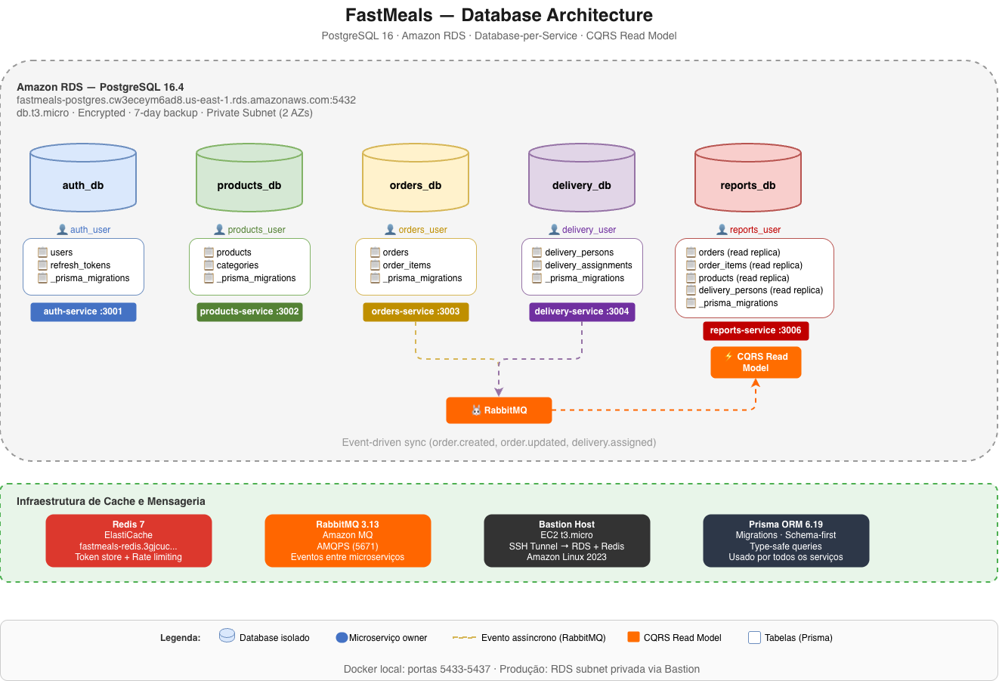

&nbsp;

### Arquitetura de Dados

| Database | Owner | Microserviço | Descrição |
|----------|-------|-------------|-----------|
| `auth_db` | `auth_user` | auth-service | Usuários, credenciais, tokens de refresh |
| `products_db` | `products_user` | products-service | Catálogo de produtos, categorias, preços |
| `orders_db` | `orders_user` | orders-service | Pedidos, itens, status, histórico |
| `delivery_db` | `delivery_user` | delivery-service | Entregadores, veículos, localização |
| `reports_db` | `reports_user` | reports-service | Read model (CQRS) para relatórios e analytics |

&nbsp;

### Padrão CQRS no Reports

O `reports_db` é um read model que replica dados dos demais bancos via eventos do RabbitMQ. Isso permite queries analíticas complexas sem impactar a performance dos serviços transacionais. As tabelas do reports (`orders`, `order_items`, `products`, `delivery_persons`) são sincronizadas via consumers que escutam eventos de criação e atualização.

&nbsp;

### Conexão Local (Docker)

| Database | Container | Porta Local | Credenciais |
|----------|-----------|-------------|-------------|
| auth_db | fastmeals-auth-db | 5433 | auth_user / auth_pass |
| products_db | fastmeals-products-db | 5434 | products_user / products_pass |
| orders_db | fastmeals-orders-db | 5435 | orders_user / orders_pass |
| delivery_db | fastmeals-delivery-db | 5436 | delivery_user / delivery_pass |
| reports_db | fastmeals-reports-db | 5437 | reports_user / reports_pass |

&nbsp;

### Conexão Produção (AWS RDS)

| Configuração | Valor |
|-------------|-------|
| **Engine** | PostgreSQL 16.4 |
| **Instance** | db.t3.micro |
| **Endpoint** | `fastmeals-postgres.cw3eceym6ad8.us-east-1.rds.amazonaws.com` |
| **Port** | 5432 |
| **Subnets** | Privadas (2 AZs) |
| **Encryption** | Habilitado |
| **Backups** | 7 dias de retenção automática |

&nbsp;

---

## 🔐 Bastion Host — Acesso ao RDS

O RDS está em uma subnet privada sem acesso direto pela internet. Para acessar os bancos de dados, utilizamos um **Bastion Host** — uma instância EC2 na subnet pública que serve como ponto de entrada seguro.

&nbsp;

### Arquitetura de Acesso

```
Seu computador (DBeaver)
        │
        │ SSH Tunnel (porta 15432)
        ▼
  ┌─────────────┐      ┌──────────────┐
  │   Bastion    │─────▶│   RDS        │
  │   EC2        │ 5432 │  PostgreSQL  │
  │  (pública)   │      │  (privada)   │
  └─────────────┘      └──────────────┘
   44.204.165.150     fastmeals-postgres...
```

&nbsp;

### Configuração
 
| Recurso | Valor |
|---------|-------|
| **Instance Type** | t3.micro |
| **AMI** | Amazon Linux 2023 |
| **Key Pair** | fastmeals-bastion |
| **Security Group** | SSH (22) + RDS (5432) + Redis (6379) |
| **IAM Role** | SSM + S3 backups + Secrets Manager read |
| **Ferramentas** | Node.js 20, Prisma CLI, AWS CLI v2, postgresql16, redis6 |
| **Volume** | 30GB gp3 encrypted |
| **Ansible Role** | Target para 7 playbooks operacionais |

&nbsp;

### Como conectar via SSH Tunnel + DBeaver

```bash
# Passo 1 — Criar túnel SSH (deixe aberto)
ssh -i ~/.ssh/fastmeals-bastion.pem \
  -L 15432:fastmeals-postgres.cw3eceym6ad8.us-east-1.rds.amazonaws.com:5432 \
  ec2-user@44.204.165.150

# Passo 2 — No DBeaver: localhost:15432, user fastmeals_admin
```

&nbsp;

### Acesso direto via Bastion (psql)

```bash
ssh -i ~/.ssh/fastmeals-bastion.pem ec2-user@44.204.165.150
psql -h fastmeals-postgres.cw3eceym6ad8.us-east-1.rds.amazonaws.com -U fastmeals_admin -d orders_db
```

&nbsp;

---

## 🤖 Ansible — Automação Operacional
 
7 playbooks para automação de operações de banco de dados e infraestrutura via **Bastion Host**, com credenciais encriptadas via **Ansible Vault** e backups automatizados para **S3**.
 
> Documentação completa em [infrastructure/ansible/README.md](infrastructure/ansible/ansible-readme.md)
 
&nbsp;
 
### Arquitetura
 
```
Sua máquina (Ansible Controller)
        │
        │ SSH (porta 22)
        ▼
  ┌─────────────┐      ┌──────────────┐
  │   Bastion    │─────▶│   RDS        │
  │   EC2        │ 5432 │  PostgreSQL  │
  │  (pública)   │      │  (privada)   │
  └──────┬───────┘      └──────────────┘
         │
         ├─────▶ Redis (6379)
         ├─────▶ RabbitMQ (5671)
         └─────▶ S3 (backups)
```
 
&nbsp;
 
### Playbooks
 
| Playbook | Comando | O que faz |
|----------|---------|-----------|
| **setup** | `ansible-playbook playbooks/setup.yml` | Instala Node.js 20, Prisma CLI, AWS CLI no Bastion |
| **migrations** | `ansible-playbook playbooks/migrations.yml` | Roda `prisma migrate deploy` nos 5 bancos |
| **seed** | `ansible-playbook playbooks/seed.yml` | Popula bancos com dados iniciais |
| **health-check** | `ansible-playbook playbooks/health-check.yml` | Verifica RDS, Redis, API Gateway, Lambda e Bastion |
| **maintenance** | `ansible-playbook playbooks/maintenance.yml` | VACUUM ANALYZE, REINDEX, kill idle connections |
| **backup** | `ansible-playbook playbooks/backup.yml` | `pg_dump` comprimido → S3 com lifecycle 7 dias |
| **disaster-recovery** | `ansible-playbook playbooks/disaster-recovery.yml` | Restore do S3 com confirmação de segurança |
 
&nbsp;
 
### Bastion Setup
 
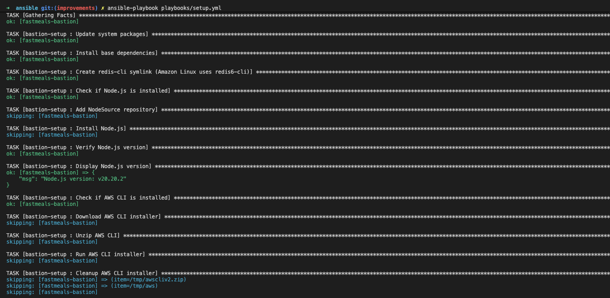
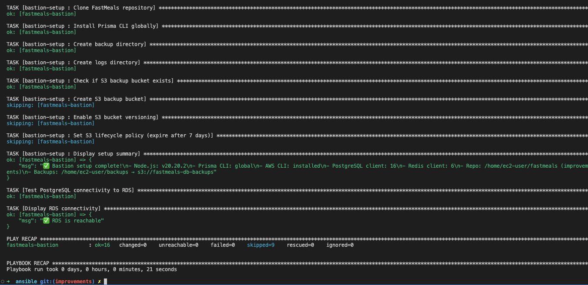
 
&nbsp;
 
### Health Check — Infraestrutura Completa
 
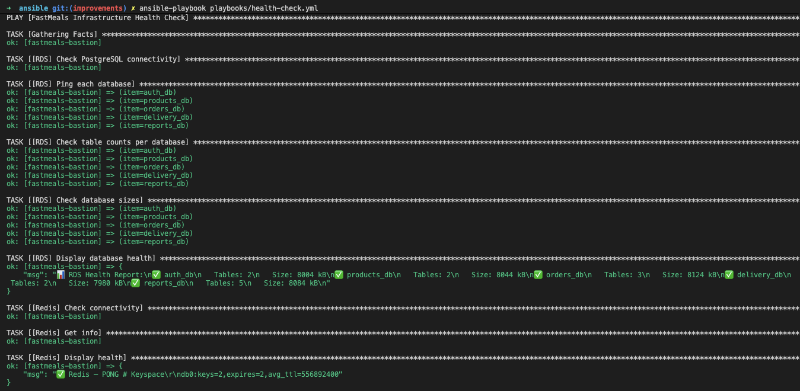
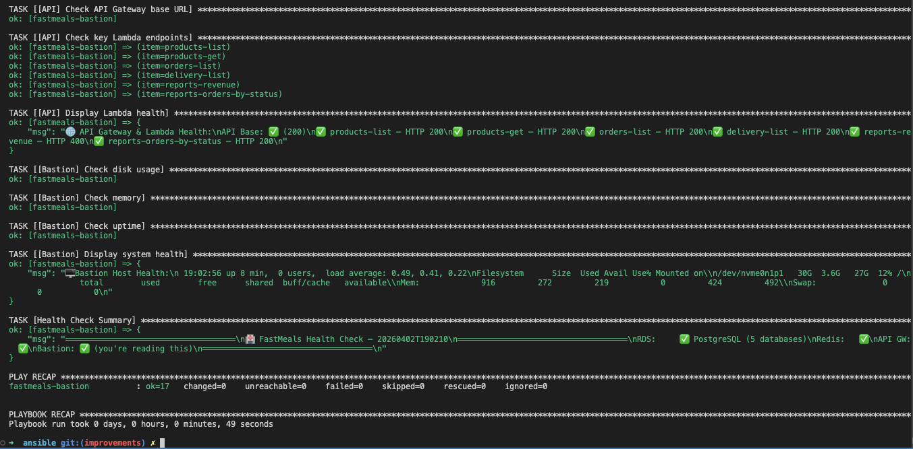
 
&nbsp;
 
---
 
## 💰 FinOps — Gestão de Custos

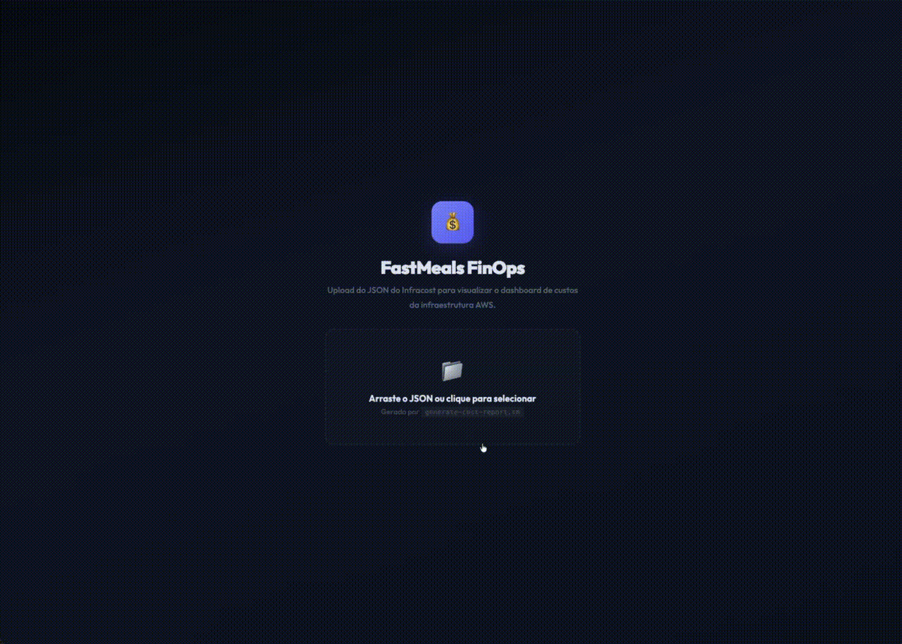
 
Estimativa de custos da infraestrutura AWS com **Infracost**, integrado ao CI/CD para mostrar o impacto financeiro em cada PR que altera o Terraform.
 
> Documentação completa em [infrastructure/finops/README.md](infrastructure/finops/finops-readme.md)
 
&nbsp;
 
### Como funciona
 
```
Developer abre PR com mudança no Terraform
        │
        ▼
GitHub Actions: Infracost
        │
        ├─ 1. Breakdown da branch main (custo atual)
        ├─ 2. Breakdown da branch do PR (custo proposto)
        ├─ 3. Diff (diferença de custo)
        ├─ 4. Comenta no PR com tabela de custos
        └─ 5. Upload para Infracost Cloud (dashboard)
```
 
&nbsp;
 
### Estimativa de Custos Atual
 
| Recurso | Custo/mês |
|---------|-----------|
| NAT Gateway | $32.85 |
| Amazon MQ (RabbitMQ) | $19.74 |
| RDS PostgreSQL (db.t3.micro) | $15.44 |
| ElastiCache Redis (cache.t3.micro) | $10.22 |
| Bastion EC2 (t3.micro) | $9.99 |
| CloudWatch Logs (24 log groups) | $24.24 |
| Secrets Manager (9 secrets) | $3.60 |
| 23 Lambda Functions | $1.15 |
| Route53 + API Gateway | $0.55 |
| **Total estimado** | **$117.70/mês** |
 
&nbsp;
 
### Cost Report (Infracost CLI)
 
Para gerar o report localmente:
 
```bash
# Tabela no terminal
./infrastructure/finops/scripts/generate-cost-report.sh
 
# HTML interativo (abre no browser)
./infrastructure/finops/scripts/generate-cost-report.sh --html
```
 
&nbsp;
 
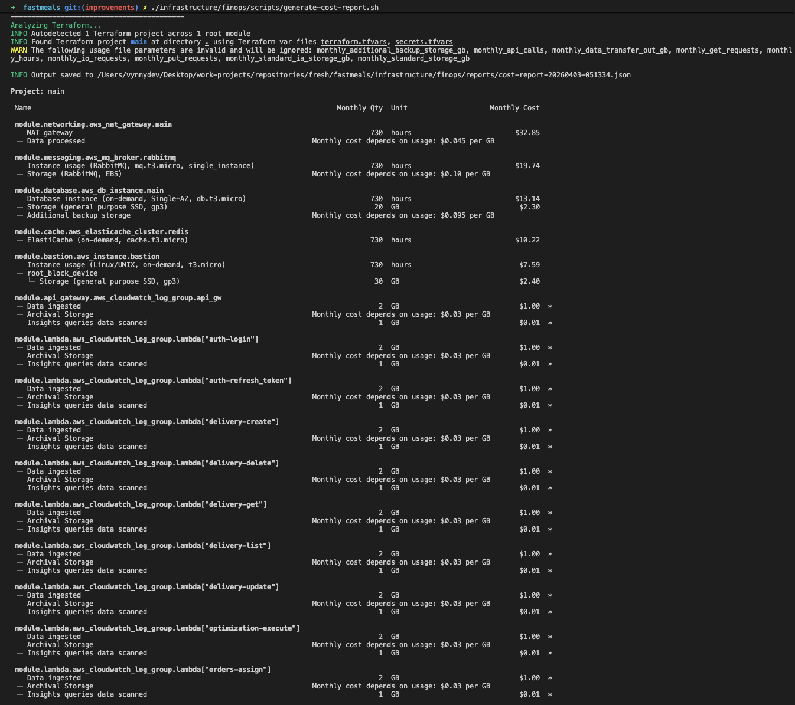
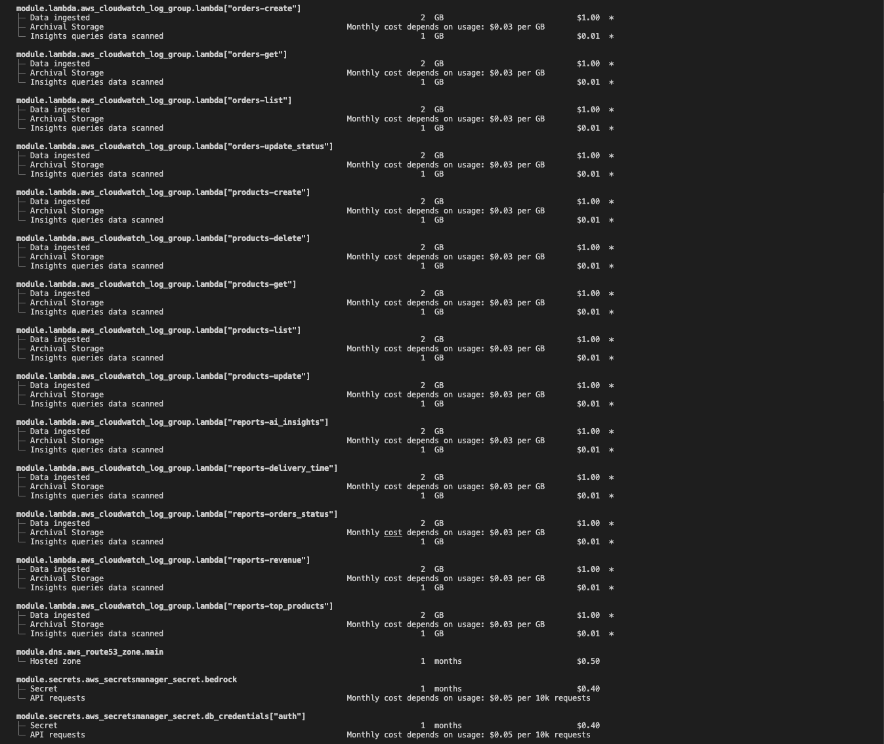
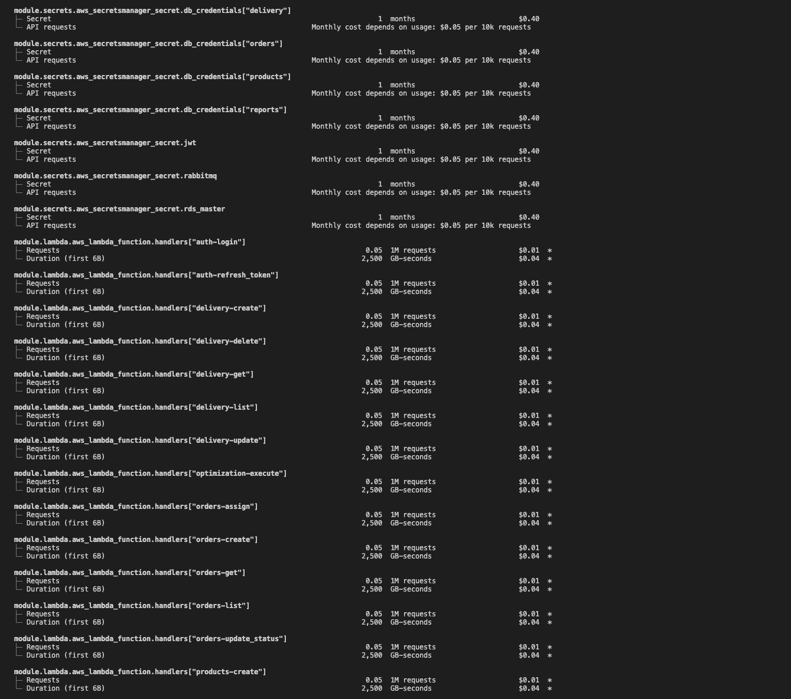
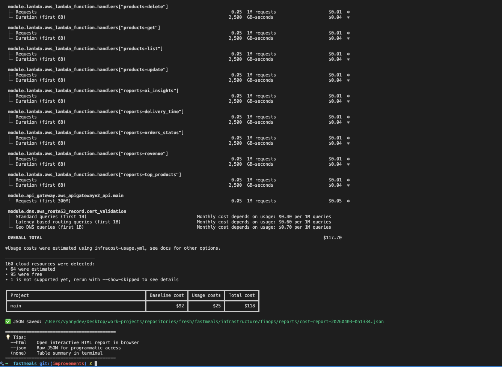
 
&nbsp;
 
---

## 📊 Observabilidade — Datadog

Todas as **23 Lambda functions** são instrumentadas com **2 Datadog Layers** (Node.js Tracer + Extension), enviando métricas, logs, traces APM e dados de invocação em tempo real.

&nbsp;

### APM Tracing — Distributed Traces

Traces distribuídos mostrando o fluxo completo de cada request: API Gateway → Lambda → PostgreSQL (via Prisma), com latência por span, status codes e erros.

&nbsp;

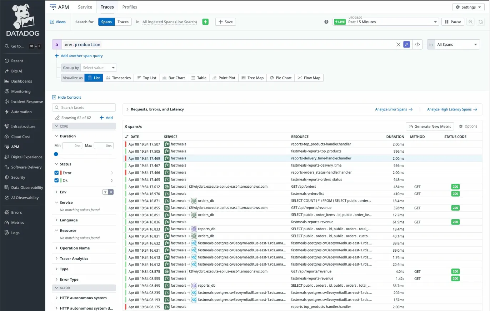

&nbsp;

### SQL Traces — Flame Graph

Detalhamento de queries SQL com Flame Graph, mostrando a query executada, database instance, duração e % de tempo de execução. Útil para identificar queries lentas e otimizar performance.

&nbsp;

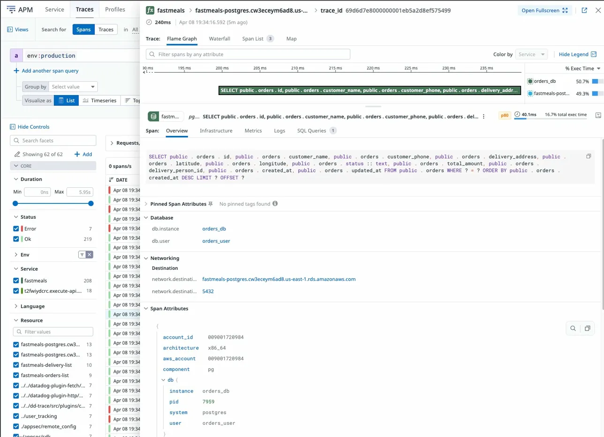

&nbsp;

### Service Map

Mapa de dependências entre serviços em tempo real, mostrando o fluxo API Gateway → Lambda → PostgreSQL com métricas de requests/s, error rate e latência P95.

&nbsp;

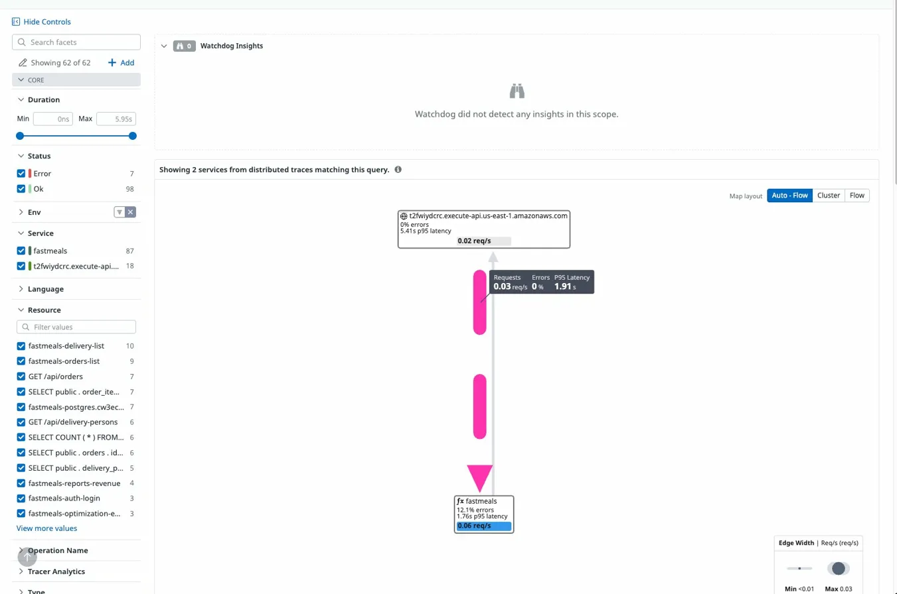

&nbsp;

### Lambda Tracing — Serverless View

Visão detalhada de cada Lambda function com invocações, cold starts, duração, tracing e mapa de dependências (Lambda → PostgreSQL).

&nbsp;

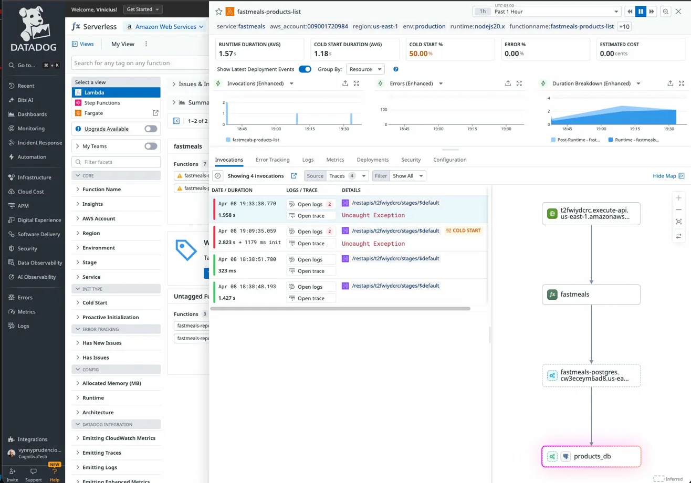

&nbsp;

### O que é monitorado

| Métrica | Descrição |
|---------|-----------|
| **APM Traces** | Distributed tracing end-to-end (API Gateway → Lambda → DB) |
| **Flame Graph** | Visualização hierárquica de tempo por span (SQL, HTTP, handlers) |
| **SQL Queries** | Queries PostgreSQL com duração, db.instance e db.user |
| **Service Map** | Topologia de dependências entre serviços em tempo real |
| **Invocations** | Número de invocações por função |
| **Duration** | Tempo de execução (avg, p50, p95, p99, max) |
| **Cold Starts** | Frequência e duração de cold starts |
| **Errors** | Taxa de erros por função |
| **Memory** | Consumo de memória por invocação |
| **Cost** | Custo estimado por função |
| **Logs** | Logs estruturados encaminhados automaticamente |

&nbsp;

### Configuração via Terraform

```hcl
# Habilitado via flag no módulo Lambda
datadog_enabled = true
datadog_site    = "us5.datadoghq.com"

# 2 Layers adicionadas automaticamente em todas as 23 Lambdas:
# 1. Datadog Node.js Tracer (dd-trace-js) — instrumentação APM
# 2. Datadog Extension — coleta e envio de dados
```

O Terraform adiciona automaticamente as **2 Datadog Layers** (Node.js Tracer + Extension), configura o `DD_LAMBDA_HANDLER` wrapper e as environment variables em todas as 23 funções Lambda.

&nbsp;

---

## 📈 Monitoring & Alerting — Datadog

5 monitors (alertas) e dashboard configurados via **Terraform** para monitoramento proativo das 23 Lambda functions e API Gateway.

> Documentação completa em [infrastructure/terraform/modules/observability/datadog-monitoring/README.md](infrastructure/terraform/modules/observability/datadog-monitoring/README.md)

&nbsp;

### Dashboard — Production Overview

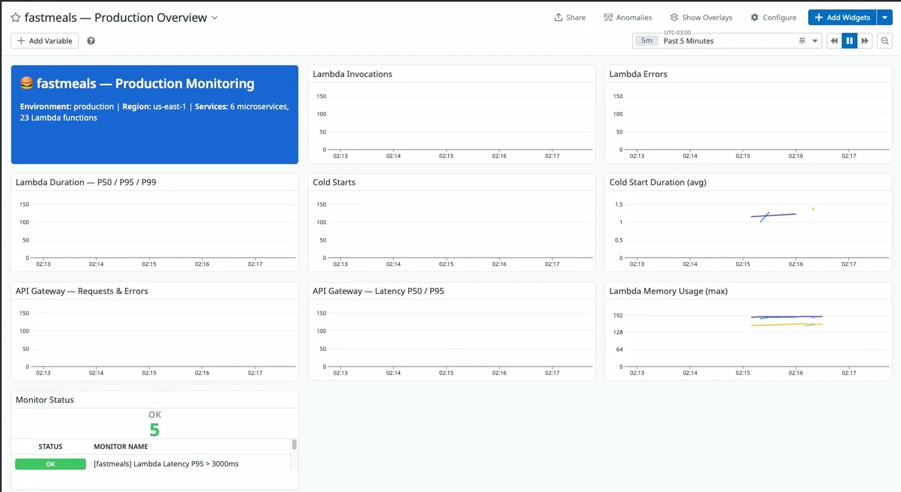

&nbsp;

### Monitors

| Monitor | Métrica | Threshold | Ação |
|---------|---------|-----------|------|
| **Lambda Error Rate** | % de invocações com erro | > 5% | Verificar APM traces com status error |
| **Lambda Latency P95** | Duração P95 | > 3000ms | Analisar SQL traces e cold starts |
| **Cold Start Rate** | % de cold starts | > 30% | Avaliar Provisioned Concurrency |
| **Lambda Throttles** | Invocações rejeitadas | > 5 em 5min | Solicitar aumento de concurrency |
| **API Gateway 5xx** | Erros server-side | > 10 em 5min | Verificar saúde das Lambda functions |

&nbsp;

### Configuração

```hcl
# Integration — layers e env vars para Lambda
module "datadog_integration" {
  source = "../modules/observability/datadog-integration"

  enabled      = true
  project_name = "fastmeals"
  dd_api_key   = var.dd_api_key
}

# Monitoring — monitors e dashboard no Datadog
module "datadog_monitoring" {
  source = "../modules/observability/datadog-monitoring"

  project_name         = "fastmeals"
  environment          = "production"
  notification_targets = "@vynnydev"
}
```

&nbsp;

---

## ✅ Qualidade de Código — SonarCloud

Análise contínua de qualidade com **SonarCloud**, integrada ao CI/CD via GitHub Actions. Quality Gate configurado com **Sonar way** (padrão da indústria).

&nbsp;

### Quality Gate — Passed

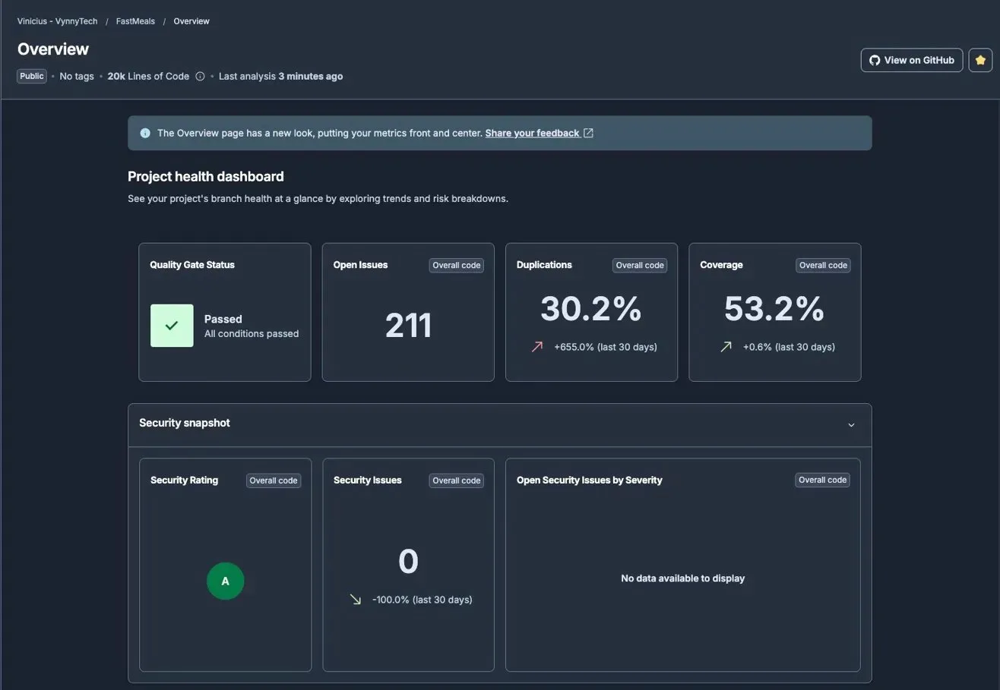

&nbsp;

### Summary — New Code

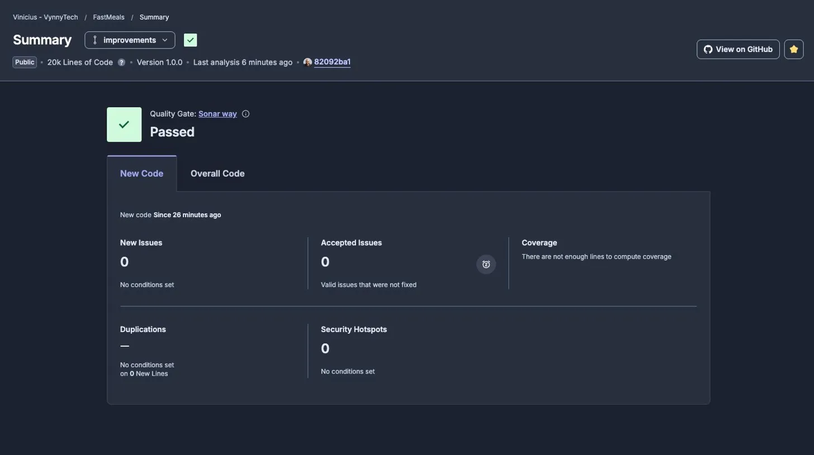

&nbsp;

### Summary — Overall Code

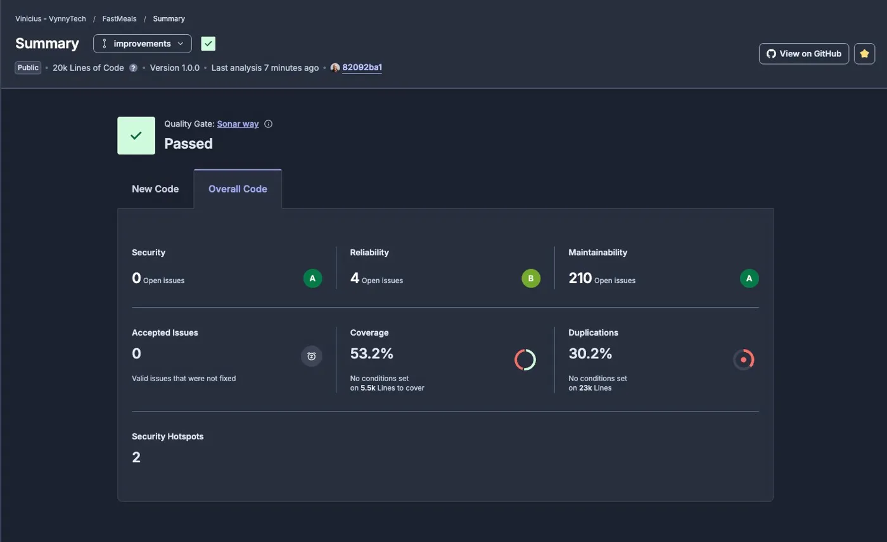

&nbsp;

### Métricas

| Métrica | Valor | Rating |
|---------|-------|--------|
| **Quality Gate** | Passed | ✅ |
| **Security** | 0 issues | A |
| **Reliability** | 4 issues | B |
| **Maintainability** | 210 issues | A |
| **Coverage** | 53.2% (backend 93-98%) | — |
| **Duplications** | 30.2% (cross-service by design) | — |
| **Security Hotspots** | 2 reviewed | — |
| **Lines of Code** | 20k | — |

> **Nota:** O coverage overall (53.2%) reflete backend + frontend combinados. O backend individualmente tem 93-98% de coverage nos 6 microserviços. O frontend utiliza testes E2E com Playwright (28 testes) ao invés de unit tests.

&nbsp;

### Configuração

O Quality Gate avalia apenas o **New Code** (código adicionado desde a última versão), garantindo que novas contribuições mantenham o padrão de qualidade. Arquivos de infraestrutura compartilhados entre microserviços (middlewares, error handlers) são excluídos da detecção de duplicação via `sonar.cpd.exclusions`.

&nbsp;

---

## 🔒 Segurança

Segurança implementada em múltiplas camadas: aplicação, infraestrutura, CI/CD e operações.

> Documentação completa em [SECURITY.md](SECURITY.md)

&nbsp;

### Application Security

| Mecanismo | Implementação |
|-----------|--------------|
| **Helmet.js** | Security headers em todos os 6 microserviços (CSP, HSTS, X-Frame-Options) |
| **JWT** | Access token 15min + Refresh token 7d com revogação via Redis |
| **bcrypt** | Hash de senhas com 10 salt rounds |
| **Rate Limiting** | Per-IP rate limiting configurável em todos os endpoints |
| **CORS** | Origins whitelisted (fastmeals.com.br em produção) |
| **Zod** | Validação de input em todos os endpoints |
| **Role-Based Access** | Admin (full) / Viewer (read-only) via middleware |

&nbsp;

### Infrastructure Security

| Camada | Proteção |
|--------|----------|
| **Network** | VPC com subnets privadas, Security Groups least-privilege |
| **Encryption at rest** | RDS encryption (AES-256) |
| **Encryption in transit** | TLS 1.2+ (HTTPS, AMQPS) via ACM |
| **Secrets** | AWS Secrets Manager (9 secrets) + Ansible Vault |
| **Bastion** | SSH restrito a IP de admin, sem acesso direto ao RDS |

&nbsp;

### CI/CD Security

| Pipeline | Frequência | O que faz |
|----------|-----------|-----------|
| **Trivy** | push + semanal | Scan de vulnerabilidades em filesystem e Docker images |
| **npm audit** | push | Auditoria de dependências em 11 packages |
| **SonarCloud** | push + PR | SAST, security hotspots, Quality Gate |
| **SARIF** | push | Upload de resultados para GitHub Security tab |

&nbsp;

---

## ⚡ Load Testing — k6

Testes de carga na API de produção usando **k6** (Grafana Labs), validando performance sob diferentes níveis de tráfego.

> Documentação completa em [load-testing/README.md](load-testing/README.md)

&nbsp;

### Smoke Test — Validação de Endpoints

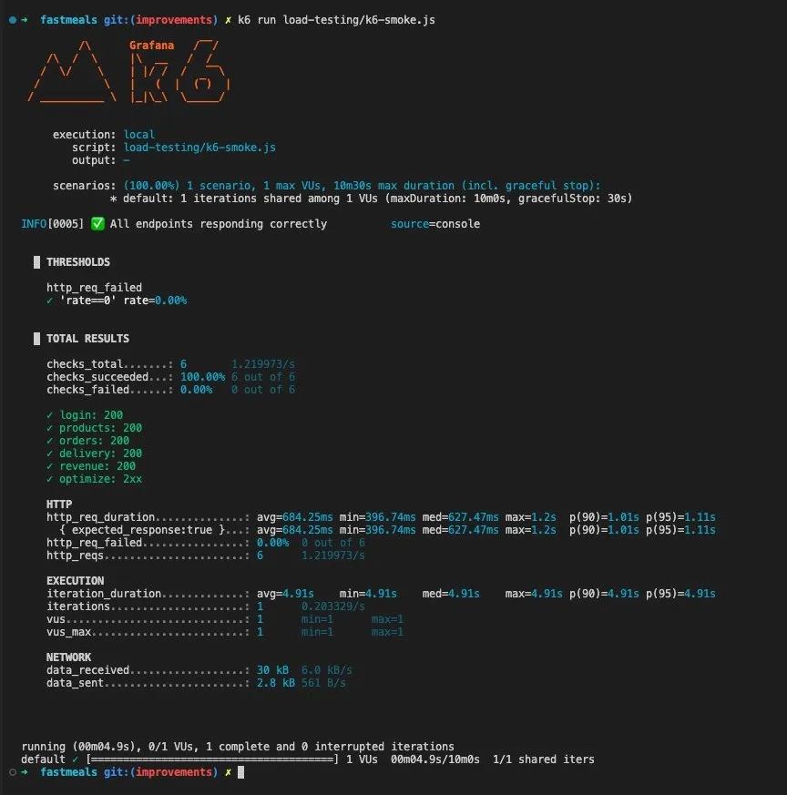

&nbsp;

### Full Load Test — Smoke + Load + Stress (20 VUs)

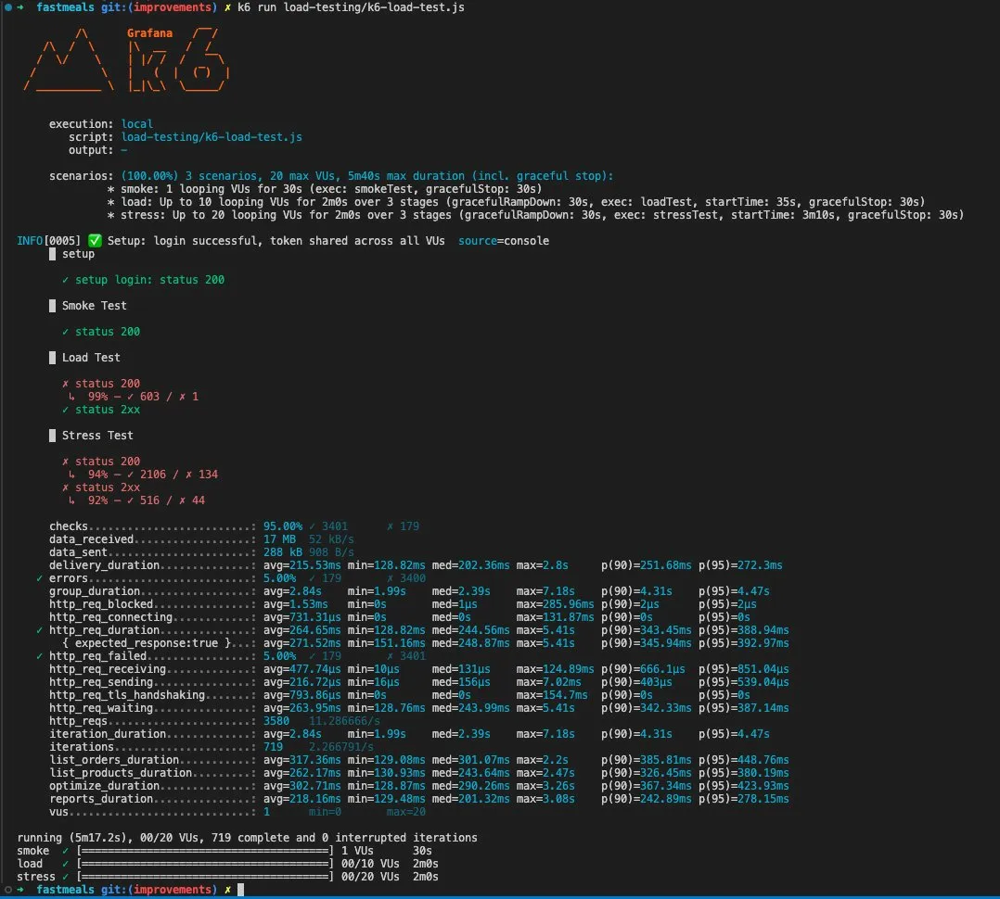

&nbsp;

### Resultados

| Métrica | Smoke (1 VU) | Full Test (20 VUs) |
|---------|-------------|-------------------|
| **Checks** | 6/6 (100%) | 3401/3580 (95%) |
| **Total requests** | 6 | 3580 |
| **Requests/s** | 1.22/s | 11.28/s |
| **Latência avg** | 684ms | 264ms |
| **Latência P95** | 1.11s | 388ms |
| **Error rate** | 0.00% | 5.00% |

&nbsp;

### Performance por Endpoint (Full Test P95)

| Endpoint | P95 | Serviço |
|----------|-----|---------|
| Reports (revenue) | 278ms | reports-service |
| Delivery persons | 272ms | delivery-service |
| Products | 380ms | products-service |
| Optimize assignment | 423ms | optimization-service |
| Orders | 448ms | orders-service |

&nbsp;

### Cenários

| Cenário | VUs | Duração | O que testa |
|---------|-----|---------|-------------|
| **Smoke** | 1 | 30s | Validação básica, todos os endpoints |
| **Load** | 0→5→10→0 | 2m | Tráfego normal, padrão de uso real |
| **Stress** | 0→10→20→0 | 2m | Alta carga, limites do sistema |

&nbsp;

### Thresholds

| Métrica | Limite | Resultado |
|---------|--------|-----------|
| Latência P95 | < 3000ms | ✅ 388ms |
| Error rate | < 10% | ✅ 5.00% |

&nbsp;

### Como rodar

```bash
# Instalar k6 (macOS)
brew install k6

# Quick smoke test
k6 run load-testing/k6-smoke.js

# Full load test (smoke → load → stress)
k6 run load-testing/k6-load-test.js
```

&nbsp;

---

## 🔄 CI/CD Pipeline
 
9 workflows no GitHub Actions com deploy automático, quality gate, security scan, load testing e cost estimation.
 
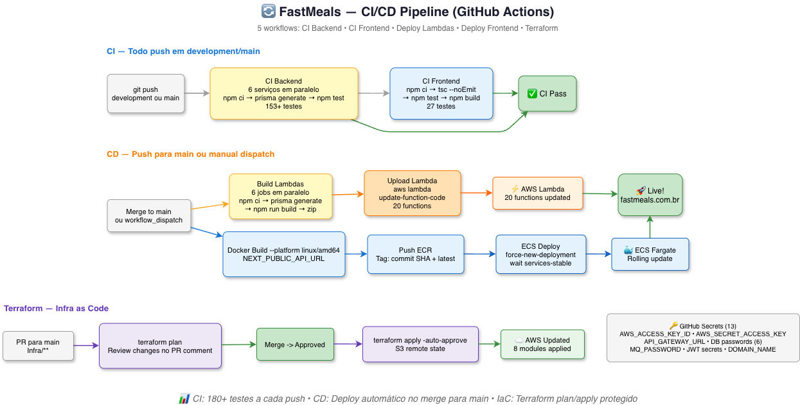
 
| Pipeline | Trigger | O que faz |
|----------|---------|-----------|
| CI Backend | push development/main/improvements | Testa 6 serviços em paralelo (608 testes, 93-98% coverage) |
| CI Frontend | push development/main/improvements | Type check + build de todos os 5 microfrontends |
| SonarCloud | push + PR | Qualidade de código, cobertura, Quality Gate |
| **Security Scan** | push + weekly (Monday 6AM) | Trivy + npm audit + SARIF → GitHub Security |
| **Load Testing** | manual (workflow_dispatch) | k6 smoke ou full load test contra produção |
| Deploy Lambdas | merge to main | Build + zip + upload 23 Lambda functions |
| Deploy Frontend | merge to main | Amplify auto-deploy via webhook |
| Terraform | PR (plan) / merge (apply) | Infra as Code com review (11 módulos) |
| **Infracost** | PR (terraform changes) | Estimativa de custo e diff no PR comment |

&nbsp;

---

## 🧪 Testes

| Camada | Framework | Quantidade | Cobertura |
|--------|-----------|-----------|-----------|
| Backend (unit) | Vitest | 430+ | Use cases, entities, services, middlewares, validators |
| Backend (integration) | Vitest + Supertest | 178+ | Controllers HTTP, auth flows, full CRUD |
| Backend (flow) | Shell script | 52 | Fluxo real entre todos os serviços |
| Frontend (E2E) | Playwright | 28 | Login, navegação, todos os microfrontends |
| **Total** | — | **608+ testes** | **93-98% coverage** |

&nbsp;

Todos os testes backend são executados com `Vitest 3.x` e coverage via `@vitest/coverage-v8`, gerando reports em `lcov` para integração com SonarCloud. Os testes E2E utilizam **Playwright** com suporte a execução local e contra produção.

&nbsp;

---

### 🎭 Frontend — Testes E2E com Playwright

**28 testes end-to-end** validando o fluxo completo da aplicação em produção, cobrindo autenticação, navegação entre microfrontends e funcionalidades de cada módulo.

&nbsp;

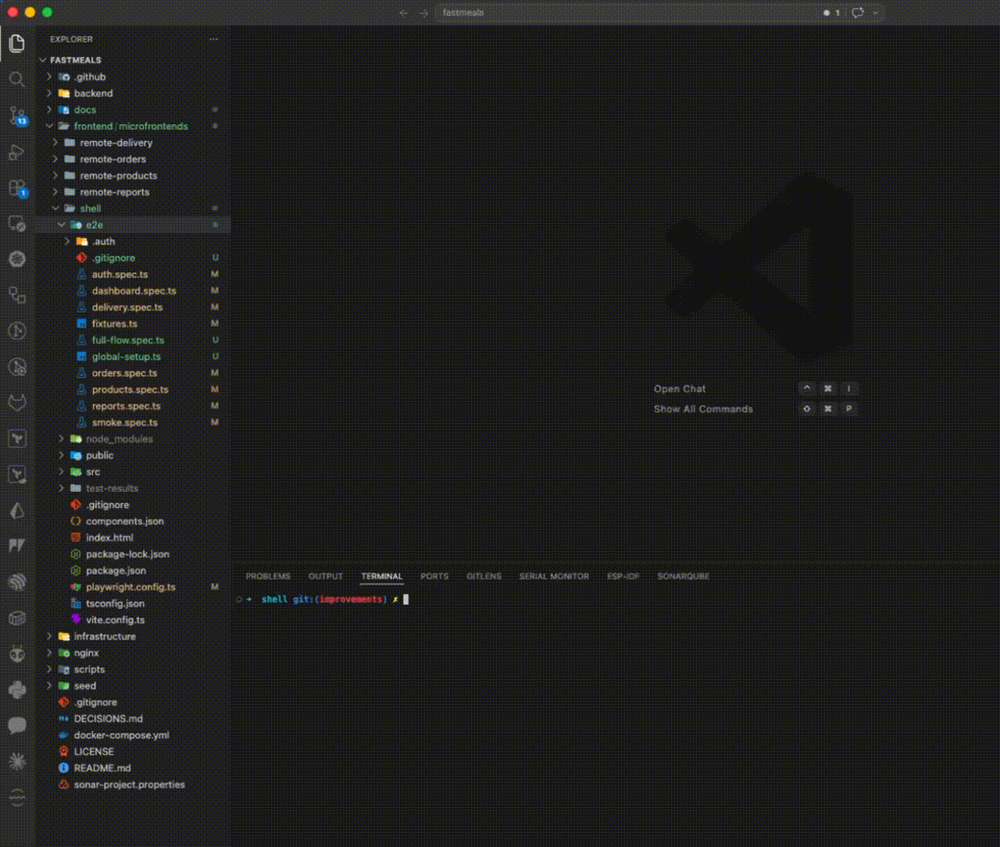

&nbsp;

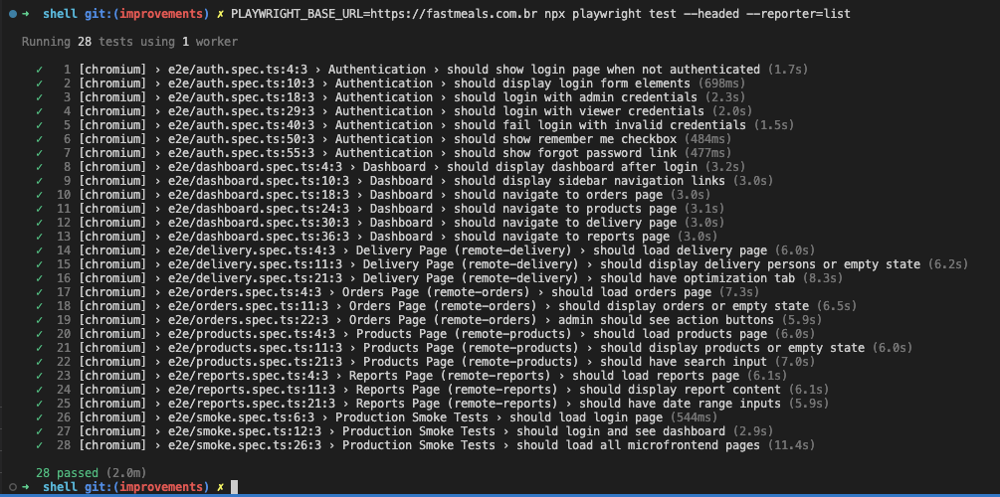

&nbsp;

| Suite | Testes | O que valida |
|-------|--------|-------------|
| auth.spec.ts | 7 | Login admin/viewer, credenciais inválidas, form elements |
| dashboard.spec.ts | 6 | Stat cards, sidebar links, navegação entre páginas |
| orders.spec.ts | 3 | Carregamento do remote, listagem, botões de ação |
| products.spec.ts | 3 | Carregamento do remote, listagem, busca |
| delivery.spec.ts | 3 | Carregamento do remote, listagem, aba de otimização |
| reports.spec.ts | 3 | Carregamento do remote, conteúdo, filtros de data |
| smoke.spec.ts | 3 | Smoke tests em produção (login + todas as páginas) |

&nbsp;

**Como rodar:**

```bash
cd frontend/microfrontends/shell

# Contra produção
PLAYWRIGHT_BASE_URL=https://fastmeals.com.br npx playwright test --reporter=list

# Com browser visível (para gravação/demo)
PLAYWRIGHT_BASE_URL=https://fastmeals.com.br npx playwright test --headed --project=full-flow

# Modo interativo
PLAYWRIGHT_BASE_URL=https://fastmeals.com.br npx playwright test --ui
```

&nbsp;

---

### 🔬 Backend — Testes Unitários e de Integração

**608 testes** com **93-98% de cobertura** em todos os 6 microserviços. Cada serviço segue a mesma estrutura: testes unitários para use cases, entities, services, middlewares e validators + testes de integração para controllers HTTP com Supertest.

&nbsp;

### 🔐 [auth-service](backend/services/auth-service/readme-auth-service.md) — 100 testes | 97.17% coverage

12 test files cobrindo autenticação JWT, refresh token com Redis, hash bcrypt, rate limiting, middlewares e error handling. 100% de cobertura em use cases, entities e controllers.

&nbsp;

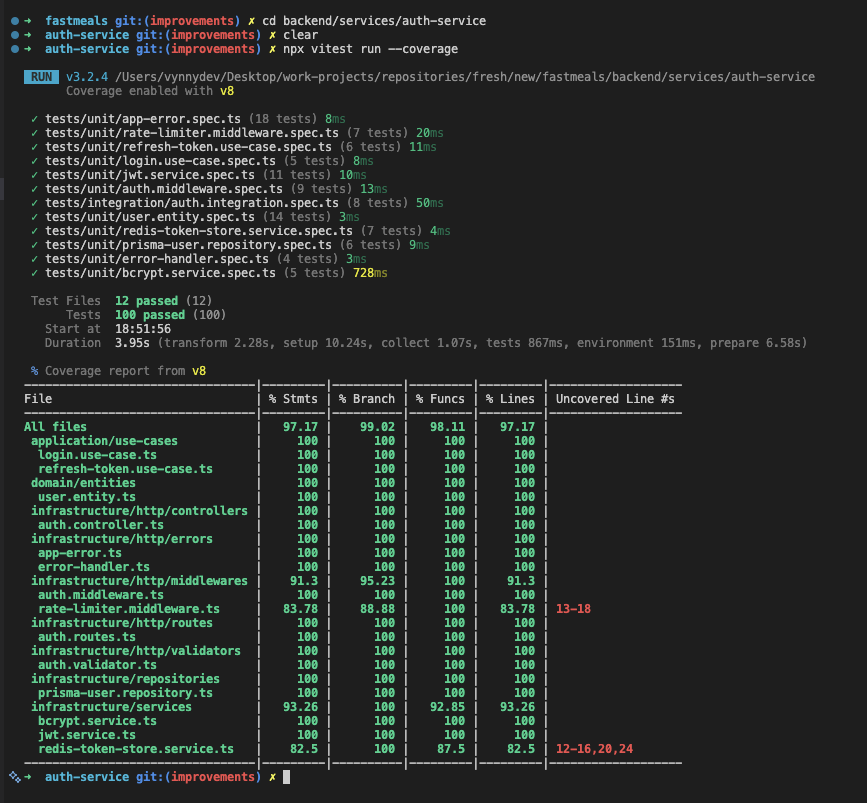

&nbsp;

### 📦 [products-service](backend/services/products-service/readme-products-service.md) — 98 testes | 97.40% coverage

11 test files cobrindo CRUD completo de produtos com paginação, busca por nome/categoria, proteção contra delete de produtos vinculados a pedidos, validação Zod e Prisma repository.

&nbsp;

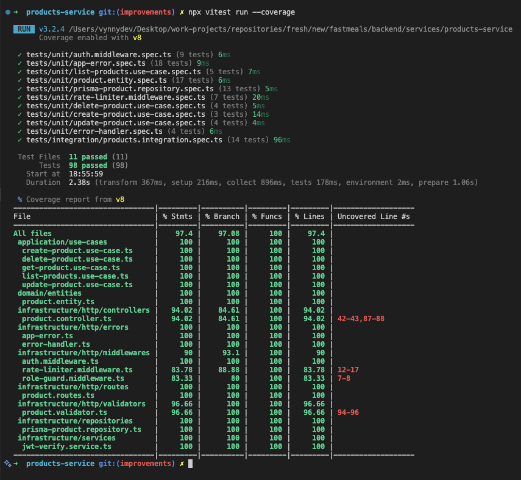

&nbsp;

### 📋 [orders-service](backend/services/orders-service/readme-orders-service.md) — 158 testes | 98.70% coverage

17 test files — o serviço mais testado. Cobre todas as transições da máquina de estados (pending → preparing → ready → delivering → delivered), comunicação inter-service (products + delivery), snapshot de preços, event publishing via RabbitMQ, entities, value objects e validação de regras de negócio.

&nbsp;

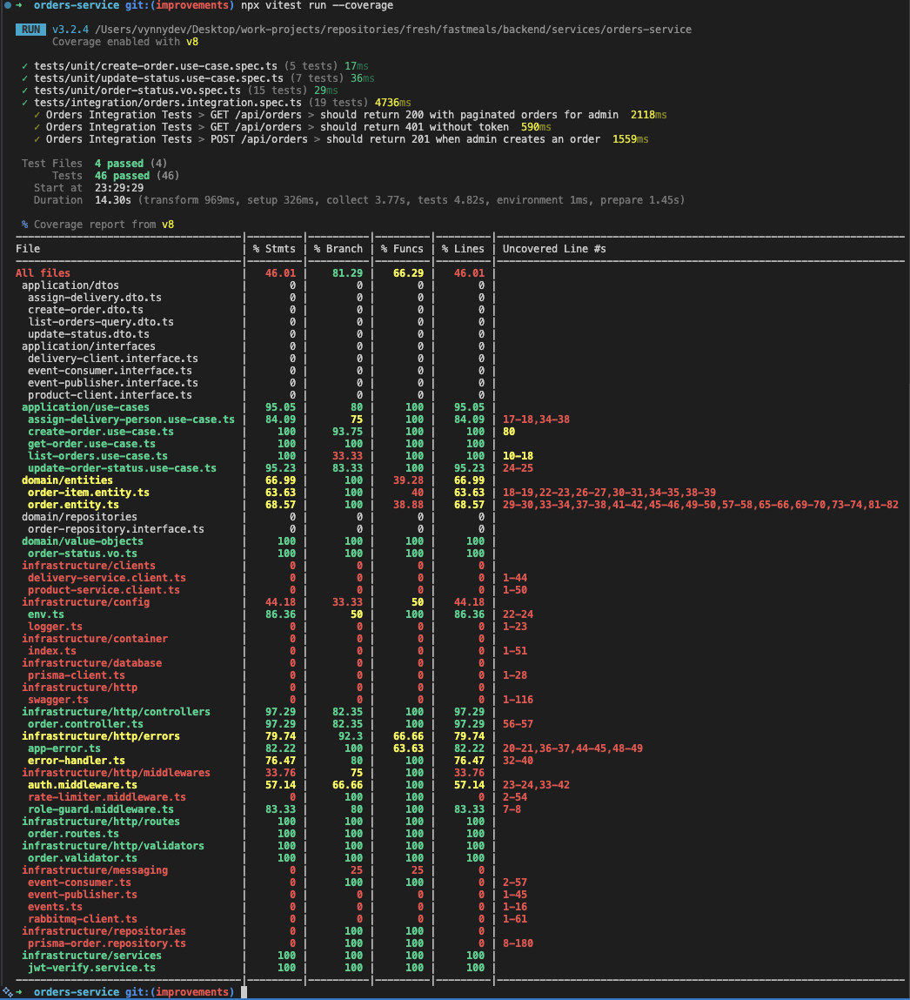

&nbsp;

### 🚴 [delivery-service](backend/services/delivery-service/readme-delivery-service.md) — 107 testes | 97.27% coverage

13 test files cobrindo CRUD de entregadores, filtro por disponibilidade, proteção contra delete de entregadores com entregas ativas, event consumer (RabbitMQ), validação de dados do veículo e Prisma repository.

&nbsp;

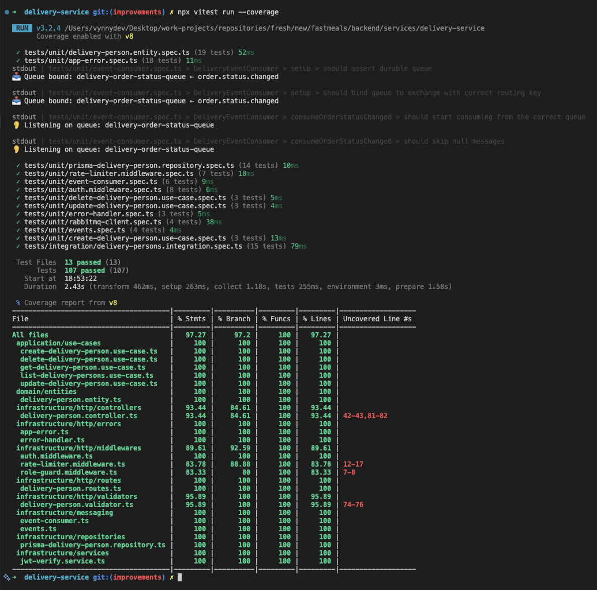

&nbsp;

### 🧠 [optimization-service](backend/services/optimization-service/readme-optimization-service.md) — 72 testes | 97.32% coverage

10 test files validando a corretude do algoritmo Hungarian (atribuição ótima vs. greedy), precisão do Haversine (< 0.1% de erro), clients HTTP (orders + delivery), middlewares e performance com matrizes 30×50 em < 87ms.

&nbsp;

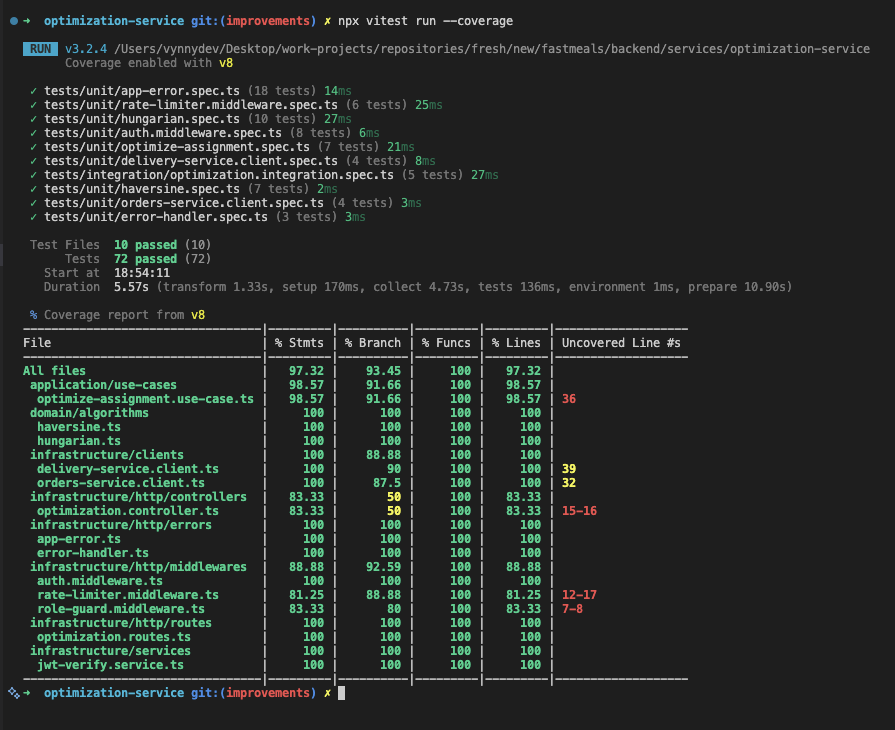

&nbsp;

### 📊 [reports-service](backend/services/reports-service/readme-reports-service.md) — 73 testes | 93.49% coverage

11 test files cobrindo revenue por período, orders-by-status, top produtos, tempo médio de entrega, AI Insights com AWS Bedrock (Amazon Nova) incluindo fallback local, Prisma repository e Bedrock service com error handling.

&nbsp;

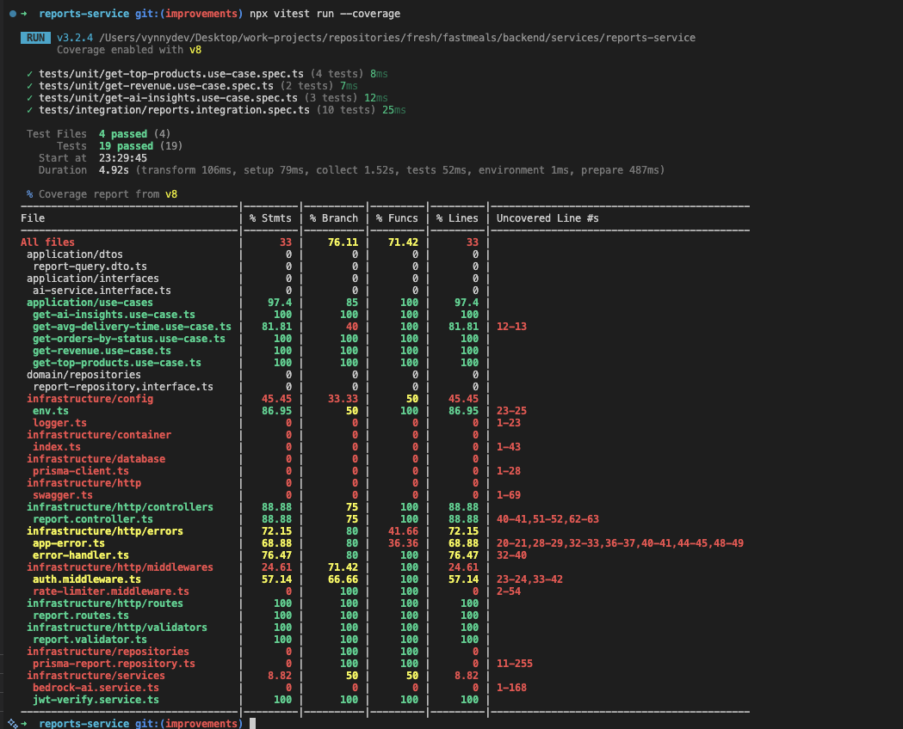

&nbsp;

---

## 📁 Estrutura do Projeto

```
fastmeals/
├── DECISIONS.md                       # 16 Architecture Decision Records
├── SECURITY.md                        # 🔒 Security practices documentation
├── README.md                          # Este arquivo
├── sonar-project.properties           # Configuração SonarCloud
├── docker-compose.yml                 # Orquestração (19 containers)
├── .github/workflows/                 # 9 CI/CD pipelines
│   ├── infracost.yml                  # 💰 Cost estimation em PRs do Terraform
│   ├── security-scan.yml             # 🔒 Trivy + npm audit + SARIF
│   └── load-test.yml                 # ⚡ k6 load testing (manual trigger)
├── nginx/
│   └── nginx.conf                     # API Gateway routing (local)
├── scripts/
│   ├── prepare-services-linux-mac.sh  # Setup automático (migrations + seed)
│   ├── prepare-services-win.bat       # Versão Windows
│   ├── deploy-lambdas.sh             # Deploy 23 Lambda functions
│   ├── test-flow.sh                   # 52 assertions de fluxo
│   └── setup-dev-environment.sh       # 🔧 Instala todas as ferramentas do projeto
├── backend/
│   └── services/
│       ├── auth-service/              # 🔐 JWT + Redis (100 testes, 97% coverage)
│       ├── products-service/          # 📦 CRUD produtos (98 testes, 97% coverage)
│       ├── orders-service/            # 📋 Pedidos + state machine (158 testes, 98% coverage)
│       ├── delivery-service/          # 🚴 Entregadores (107 testes, 97% coverage)
│       ├── optimization-service/      # 🧠 Hungarian + Haversine (72 testes, 97% coverage)
│       └── reports-service/           # 📊 Analytics + AI (73 testes, 93% coverage)
├── frontend/
│   └── microfrontends/
│       ├── shell/                     # 🏠 Host + Playwright E2E (28 testes)
│       ├── remote-orders/             # 📋 Pedidos: tabela, cards, kanban, CRUD
│       ├── remote-products/           # 📦 Produtos: grid, tabela, CRUD
│       ├── remote-delivery/           # 🚴 Entregadores + Otimização Hungarian
│       └── remote-reports/            # 📊 Charts, Analytics, AI Insights
├── infrastructure/
│   ├── ansible/                       # 🤖 7 playbooks operacionais
│   │   ├── playbooks/                 # migrations, seed, health-check, backup, etc.
│   │   ├── roles/bastion-setup/       # Role: Node.js, Prisma, AWS CLI
│   │   ├── scripts/                   # Wrappers de execução rápida
│   │   └── group_vars/               # Variáveis + secrets (vault)
│   ├── finops/                        # 💰 Infracost cost estimation
│   │   ├── infracost.yml              # Usage estimates para custos precisos
│   │   └── scripts/                   # Report local (table, HTML, JSON)
│   └── terraform/                     # ☁️ 11 módulos Terraform
│       ├── bootstrap/                 # S3 + DynamoDB (state)
│       ├── modules/                   # networking, database, cache, messaging,
│       │   ├── ...                    # lambda, api-gateway, frontend, dns,
│       │   │                          # bastion, secrets
│       │   └── observability/         # 📊 Datadog (2 submódulos)
│       │       ├── datadog-integration/  # Layers + env vars para Lambda
│       │       └── datadog-monitoring/   # 5 monitors + dashboard
│       └── environments/production/   # Entry point
├── load-testing/                      # ⚡ k6 load testing
│   ├── k6-smoke.js                    # Quick smoke test (1 iteração)
│   ├── k6-load-test.js                # Full test (smoke → load → stress)
│   └── README.md                      # Documentação e instalação
└── docs/
    ├── api-spec.md                    # Especificação completa da API
    ├── database-schema.md             # Schema do banco de dados
    ├── images/                        # Screenshots (tests, observability, ansible, finops)
    ├── evidences/                     # Screenshots
    └── diagrams/                      # 9 diagramas draw.io
        ├── images/                    # PNGs exportados
        └── xml/                       # Arquivos .drawio editáveis
```

&nbsp;

---

## 📖 Documentação
 
| Documento | Descrição |
|-----------|-----------|
| [DECISIONS.md](DECISIONS.md) | 16 ADRs — decisões arquiteturais com trade-offs |
| [SECURITY.md](SECURITY.md) | Práticas de segurança: app, infra, CI/CD, checklist |
| [API Spec](docs/api-spec.md) | Especificação completa de todos os endpoints |
| [Database Schema](docs/database-schema.md) | Esquema do banco de dados |
| [Auth Service](backend/services/auth-service/README.md) | JWT, Redis, bcrypt |
| [Products Service](backend/services/products-service/README.md) | CRUD com paginação e busca |
| [Orders Service](backend/services/orders-service/README.md) | State machine, inter-service, RabbitMQ |
| [Delivery Service](backend/services/delivery-service/README.md) | CRUD, disponibilidade, RabbitMQ |
| [Optimization Service](backend/services/optimization-service/README.md) | Hungarian O(n³), Haversine |
| [Reports Service](backend/services/reports-service/README.md) | Analytics, CQRS, AI Insights |
| [Ansible Automation](infrastructure/ansible/README.md) | 7 playbooks: migrations, seeds, backups, health checks |
| [FinOps (Infracost)](infrastructure/finops/README.md) | Estimativa de custos AWS com CI/CD |
| [Load Testing (k6)](load-testing/README.md) | Testes de carga: smoke, load e stress |
| [Monitoring (Datadog)](infrastructure/terraform/modules/observability/datadog-monitoring/README.md) | 5 alertas + dashboard Terraform |
| [Datadog Integration](infrastructure/terraform/modules/observability/datadog-integration/README.md) | Lambda layers + env vars para APM tracing |
| [Guia de Tecnologias](docs/tech-stack-guide.md) | 25 tecnologias com vantagens, desvantagens e comandos |
| [Referência de Comandos](docs/commands-reference.md) | Todos os comandos AWS, Terraform, Docker, Git, Playwright |

&nbsp;

### Swagger (OpenAPI)

Cada serviço possui documentação interativa acessível em `/docs`:

| Serviço | URL |
|---------|-----|
| Auth | http://localhost:3001/docs |
| Products | http://localhost:3002/docs |
| Orders | http://localhost:3003/docs |
| Delivery | http://localhost:3004/docs |
| Optimization | http://localhost:3005/docs |
| Reports | http://localhost:3006/docs |

&nbsp;

---

## 🔑 Variáveis de Ambiente

Todas as variáveis estão definidas no `docker-compose.yml`. Para desenvolvimento local, copie `.env.example` para `.env` em cada serviço.

| Variável | Serviços | Descrição |
|----------|----------|-----------|
| `DATABASE_URL` | auth, products, orders, delivery, reports | Connection string PostgreSQL |
| `JWT_ACCESS_SECRET` | Todos | Secret compartilhado para validação JWT |
| `REDIS_URL` | auth | URL do Redis para token store |
| `RABBITMQ_URL` | orders, delivery | URL do RabbitMQ |
| `PRODUCTS_SERVICE_URL` | orders, optimization | HTTP client para products-service |
| `DELIVERY_SERVICE_URL` | orders, optimization | HTTP client para delivery-service |
| `ORDERS_SERVICE_URL` | optimization | HTTP client para orders-service |
| `AWS_REGION` | reports | Região AWS para Bedrock |
| `CORS_ORIGIN` | Todos | Origem permitida |
| `VITE_API_URL` | frontend (remotes) | URL do API Gateway (vazio em dev para usar proxy) |
| `DD_API_KEY` | Lambda (Datadog) | API Key do Datadog |
| `DD_SITE` | Lambda (Datadog) | Site do Datadog (us5.datadoghq.com) |

&nbsp;

---

## 🐳 Docker

O `docker-compose.yml` orquestra **19 containers** (7 infra + 6 backend + 5 frontend + 1 gateway):

| Container | Imagem | Porta | Função |
|-----------|--------|-------|--------|
| auth-db | postgres:16-alpine | 5433 | Banco auth |
| products-db | postgres:16-alpine | 5434 | Banco products |
| orders-db | postgres:16-alpine | 5435 | Banco orders |
| delivery-db | postgres:16-alpine | 5436 | Banco delivery |
| reports-db | postgres:16-alpine | 5437 | Banco reports (CQRS) |
| redis | redis:7-alpine | 6379 | Token store |
| rabbitmq | rabbitmq:3.13-management | 5672 / 15672 | Mensageria + UI |
| auth-service | node:20-alpine | 3001 | Microserviço |
| products-service | node:20-alpine | 3002 | Microserviço |
| orders-service | node:20-alpine | 3003 | Microserviço |
| delivery-service | node:20-alpine | 3004 | Microserviço |
| optimization-service | node:20-alpine | 3005 | Microserviço |
| reports-service | node:20-alpine | 3006 | Microserviço |
| mfe-shell | node:20-alpine | 5000 | Frontend host (Vite) |
| mfe-remote-orders | node:20-alpine | 5001 | Microfrontend pedidos |
| mfe-remote-products | node:20-alpine | 5002 | Microfrontend produtos |
| mfe-remote-delivery | node:20-alpine | 5003 | Microfrontend entregas |
| mfe-remote-reports | node:20-alpine | 5004 | Microfrontend relatórios |
| nginx | nginx:alpine | 80 | API Gateway |

&nbsp;

---

## 👨‍💻 Autor

**Vinicius Prudencio** — Full Stack & DevOps Engineer

[](https://github.com/vynnydev)
[](https://linkedin.com/in/vynnydev)

---

*Desenvolvido como teste técnico para Eyecare Health — Março 2026*